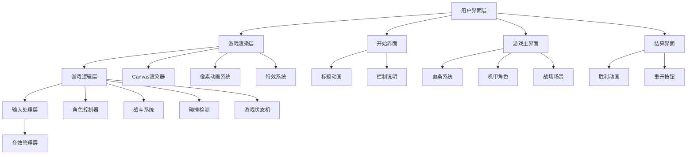
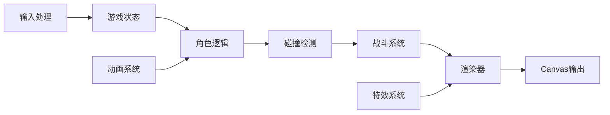
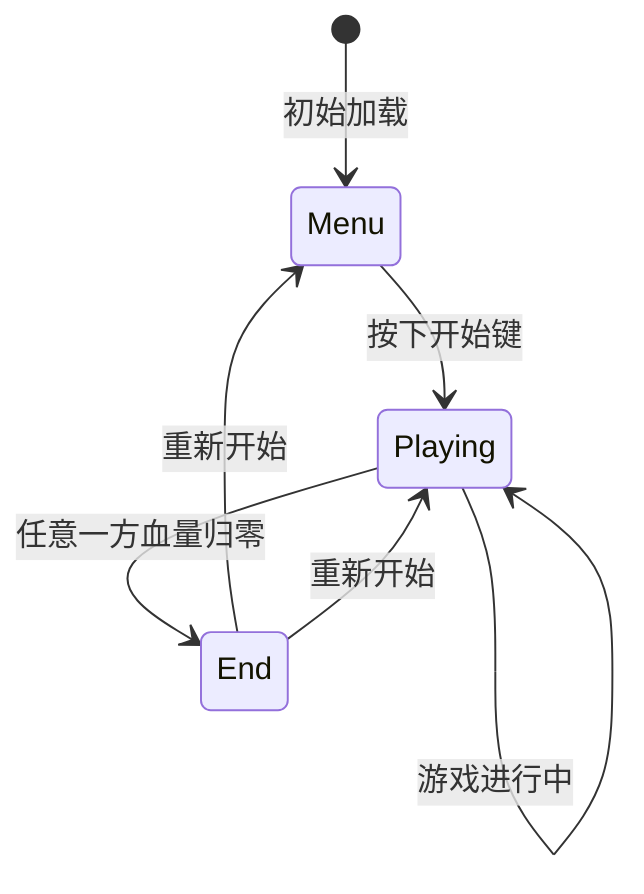
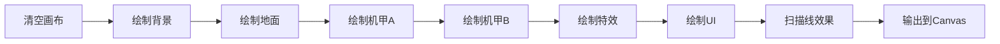

# 像素风机甲对战游戏 - 技术架构文档

## 1. 系统架构设计



## 2. 技术选型

### 2.1 核心技术栈

- **渲染引擎**：HTML5 Canvas 2D Context
- **编程语言**：原生JavaScript ES6+
- **样式设计**：CSS3（UI界面、特效）
- **游戏循环**：requestAnimationFrame
- **动画系统**：帧动画控制器
- **音效处理**：Web Audio API

### 2.2 项目结构

```
/workspace
├── index.html          # 主入口页面
├── game.html           # 游戏页面（可选）
├── css/
│   └── styles.css      # 样式表
├── js/
│   ├── main.js         # 游戏入口
│   ├── game.js         # 游戏主逻辑
│   ├── player.js       # 角色类
│   ├── renderer.js     # 渲染器
│   ├── input.js        # 输入处理
│   ├── combat.js       # 战斗系统
│   ├── animation.js    # 动画系统
│   └── effects.js      # 特效系统
├── assets/
│   ├── sprites/        # 像素精灵图
│   └── sounds/         # 音效文件
└── documents/
    ├── PRD.md          # 产品需求文档
    └── ARCHITECTURE.md # 本文档
```

### 2.3 模块依赖关系



## 3. 核心类设计

### 3.1 Game 类（游戏主控）

```javascript
class Game {
  - canvas: HTMLCanvasElement
  - ctx: CanvasRenderingContext2D
  - players: Player[]
  - gameState: 'menu' | 'playing' | 'end'
  - currentFrame: number
  
  + init()
  + update()
  + render()
  + gameLoop()
  + checkWinCondition()
  + reset()
}
```

### 3.2 Player 类（角色控制）

```javascript
class Player {
  - id: number
  - x, y: number
  - width, height: number
  - velocityX, velocityY: number
  - health: number
  - maxHealth: number
  - state: 'idle' | 'walk' | 'jump' | 'attack' | 'defend' | 'hit' | 'win'
  - facing: 'left' | 'right'
  - attackCooldown: number
  - animation: AnimationController
  
  + move(direction)
  + jump()
  + attack(type)
  + defend()
  + takeDamage(amount)
  + update()
  + render()
  + checkCollision(other)
}
```

### 3.3 AnimationController 类（动画控制）

```javascript
class AnimationController {
  - frames: ImageData[]
  - currentFrame: number
  - frameRate: number
  - isPlaying: boolean
  - loop: boolean
  
  + play()
  + pause()
  + reset()
  + getCurrentFrame()
  + nextFrame()
}
```

### 3.4 CombatSystem 类（战斗系统）

```javascript
class CombatSystem {
  - lightAttackDamage: 10
  - heavyAttackDamage: 25
  - lightAttackCooldown: 300ms
  - heavyAttackCooldown: 1000ms
  - defenseReduction: 0.5
  
  + calculateDamage(attackType, isDefending)
  + checkHit(attacker, defender)
  + applyDamage(target, damage)
}
```

### 3.5 InputHandler 类（输入处理）

```javascript
class InputHandler {
  - keyStates: Map<string, boolean>
  - player1Controls: Object
  - player2Controls: Object
  
  + handleKeyDown(event)
  + handleKeyUp(event)
  + getPlayerInput(playerId)
  + reset()
}
```

## 4. 游戏状态机



## 5. 渲染管线

### 5.1 渲染流程



### 5.2 渲染层次

1. **背景层**：静态场景
2. **地面层**：可交互地面
3. **角色层**：机甲精灵
4. **特效层**：攻击特效、粒子
5. **UI层**：血条、分数、状态信息
6. **效果层**：扫描线、色调调整

## 6. 像素素材方案

### 6.1 精灵图规格

- **分辨率**：64x64 像素（每帧）
- **缩放比例**：4x（实际显示 256x256）
- **颜色深度**：16色调色板
- **格式**：PNG（带透明通道）

### 6.2 像素机甲设计指南

#### 红狼机甲（Red Wolf）
- **主色**：#E63946（红）、#1D3557（深蓝）、#F1FAEE（白）
- **特点**：棱角分明、装甲尖刺、热血风格
- **动画**：攻击动作有力、待机时轻微起伏

#### 蓝鹰机甲（Blue Eagle）
- **主色**：#457B9D（蓝）、#1D3557（深蓝）、#A8DADC（浅蓝）
- **特点**：流线型、机械关节、冷静风格
- **动画**：动作流畅、防御姿态优雅

### 6.3 背景素材

- **天空**：深色工业背景 #2B2D42
- **建筑**：剪影式工厂 #8D99AE
- **地面**：金属纹理 #3D405B
- **装饰**：管道、烟囱、警示标识

## 7. 碰撞检测方案

### 7.1 碰撞盒定义

```javascript
// 角色碰撞盒
hitbox = {
  x: player.x + offsetX,
  y: player.y + offsetY,
  width: 48,
  height: 60
}

// 攻击判定盒
attackbox = {
  x: attackOrigin.x,
  y: attackOrigin.y,
  width: 40,
  height: 30
}
```

### 7.2 AABB碰撞检测

```javascript
function checkAABBCollision(box1, box2) {
  return box1.x < box2.x + box2.width &&
         box1.x + box1.width > box2.x &&
         box1.y < box2.y + box2.height &&
         box1.y + box1.height > box2.y;
}
```

## 8. 输入映射表

### 8.1 玩家1控制（红色方）

| 按键 | 功能 | 动作类型 |
|------|------|----------|
| W | 跳跃 | 瞬时触发 |
| A | 向左移动 | 持续按下 |
| S | 下蹲/防御 | 持续按下 |
| D | 向右移动 | 持续按下 |
| J | 轻攻击 | 瞬时触发 |
| K | 重攻击 | 瞬时触发 |

### 8.2 玩家2控制（蓝色方）

| 按键 | 功能 | 动作类型 |
|------|------|----------|
| ↑ | 跳跃 | 瞬时触发 |
| ← | 向左移动 | 持续按下 |
| ↓ | 下蹲/防御 | 持续按下 |
| → | 向右移动 | 持续按下 |
| 1 | 轻攻击 | 瞬时触发 |
| 2 | 重攻击 | 瞬时触发 |

## 9. 音效接口设计

### 9.1 音效管理器

```javascript
class SoundManager {
  - audioContext: AudioContext
  - sounds: Map<string, AudioBuffer>
  
  + loadSound(name, url)
  + play(name)
  + playAttack(type)
  + playHit()
  + playVictory()
  + setVolume(level)
}
```

### 9.2 音效清单

| 音效名称 | 用途 | 建议格式 |
|---------|------|---------|
| attack_light | 轻攻击 | 短促8-bit音效 |
| attack_heavy | 重攻击 | 强力撞击声 |
| hit | 命中 | 金属碰撞 |
| jump | 跳跃 | 简短上升音 |
| victory | 胜利 | 胜利旋律 |
| bgm | 背景音乐 | 循环8-bit战斗曲 |

## 10. 性能优化策略

### 10.1 渲染优化
- 仅重绘变化的区域（脏矩形）
- 使用离屏Canvas预渲染静态元素
- 限制粒子数量（最多50个）

### 10.2 动画优化
- 使用精灵图而非程序生成像素
- 缓存动画帧到ImageData
- 帧率锁定60FPS

### 10.3 内存优化
- 及时释放不使用的声音资源
- 避免在游戏循环中创建对象
- 使用对象池管理粒子

## 11. 浏览器兼容性

- Chrome 60+
- Firefox 55+
- Safari 11+
- Edge 79+
- 需要支持Canvas 2D和Web Audio API

## 12. 可扩展性设计

### 12.1 预留接口
- 新增角色类型
- 新增攻击方式
- 新增游戏模式
- 联机模式扩展

### 12.2 配置化设计
- 机甲属性可通过配置调整
- 动画帧数可自定义
- 场景元素可动态加载
